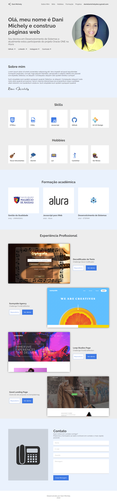

# Front-End - Challenge One - Oracle Next Education

Semana 1 e 2: Do Figma ao HTML e CSS é um desafio de código do programa da Oracle proposto pela Alura.

### Screenshot

### Links

- Solução URL: https://danimichelydev.github.io/frontend-semana-1-e-2/

### Construído com

- HTML5

- CSS3

- JavaScript

  

### Autora

- Linkedin: https://www.linkedin.com/in/dani-michely/

